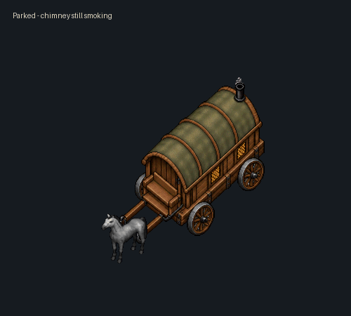
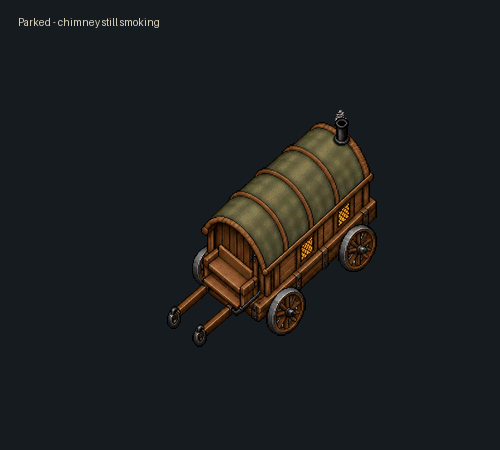

# UO Asset Library

Browse the gallery and use the small Download link on an item to get its files. Open an armour set to inspect or download the complete set or an individual piece.

The library contains 333 listings with 419 ZIP packages. Shared collections stay together when their import tools require the full set.

- Equipment: native 35-action VDs, inventory icons and male/female paperdoll images.
- Creatures and mounts: native VDs and available setup files.
- Effects: PNG frames, animation metadata, import preparation and supplied Sphere scripts.
- World content: sprites and import files, or Sphere house scripts and layouts.
- Interface: PNG designs/components, labelled where UI integration is still required.

Packages are organised under public/gallery/downloads by category. Every package has usage notes and SHA-256 checksums. Creation prompts, design atlases, reference images, private workspace files, accounts, saves and test logs are excluded. GIFs and viewer images are previews; game files are in the ZIP downloads.

Use a development copy, check the chosen IDs and file access, close asset users and back up current data before importing. Read the package instructions and test the result in game. Some effects provide visual art only and require server behaviour. Interface artwork requires assembly. Dragon rider seating requires the supplied client integration patch; no replacement client executable is distributed.

## Website

Open public/index.html locally, or serve public as a static site. The site has search, category filters, complete armour sets with selectable pieces, and action/facing previews. No accounts, analytics or third-party browser libraries are needed.

Build: node tools/build.mjs
Tests: node --test tests/*.test.mjs

Only public is deployed to Cloudflare Workers. wrangler.jsonc configures that directory. The optional original catalogue builder remains available; the populated gallery is the homepage.

## Travelling Caravan

[Open the animated example](https://uo-asset-library.farthrex.workers.dev/#travelling-caravan) · [Download the test build](public/gallery/downloads/world/travelling-caravan.zip)

A movable UO-style caravan in two versions, with and without a harness horse. The wheels turn while travelling and stop when parked; chimney smoke continues. Passengers, furniture, loose floor items and cargo containers keep their positions as the caravan moves and turns, including items nested inside containers.

Each version includes a placement deed. Successful placement gives the owner reins in their backpack for boarding, travelling, parking, turning, leaving and securing furniture. The cabin has walkable rear steps, a cargo chest and a bedroll. Travel requires clear, level land with sufficient turning space.

Sphere X test build with a guarded native-data installer and rollback backup. Includes four facings, native wheel/horse/smoke animation, two deeds and setup instructions. After installation, a GM can create the deeds with `.add i_deed_gc_caravan` and `.add i_deed_gc_horse_caravan`.

The isolated tests passed 226 movement/cargo checks, 20 connected-player access checks and installer/rollback checks. Native roof cutaway, lighting and player overlap still require an in-game visual check. The horse is an attached animated part rather than a pet; the rear door is decorative and this build has no redeeding command. Preview GIFs are assembled native frames, not game recordings.

### Caravan placement update

Fixed decimal terrain-coordinate lookup, including placement on flat Green Acres grass. The placer can stand in the footprint and is moved to the rear landing on success; other players, objects and uneven ground still block placement with an explanation. Continuous travel also retains the first-step result reliably. Both deeds were tested on the actual Green Acres map with a connected non-GM player: placement, boarding, driving, passenger position and parking pass. The movement/collision matrix passes 232 checks.

For an existing caravan installation, back up and replace only `scripts/items/travelling_caravan.scp` from the new ZIP, then restart Sphere or resynchronise its scripts. Existing deeds remain valid; no client-art update is needed. The full installer remains for first installation.
