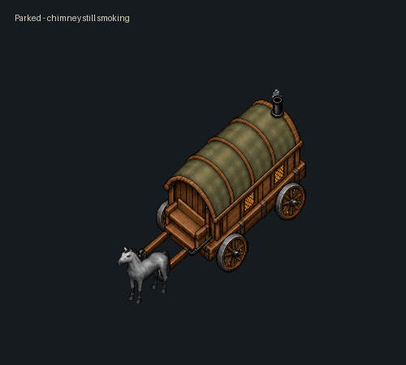
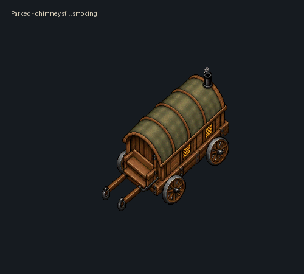

# UO Asset Library

## UO Asset Studio

Version 0.32.5 puts five direct artwork imports on Home and a dedicated Import artwork sidebar page in both modes: Tiles, Statics, Gumps, Animation and Mounts. All tools shows 34 tools under visible Import artwork, Browse & preview, Server scripts, Build worlds and Files & distribution headings. Search, filters and Enter remain available. Other imports, standalone VD conversion, whole-body export, reviewed saves, tile-pack selection safeguards and website updates are retained.

Version 0.32.2 fixes whole-body UOP export for duplicate body definitions and the additional Animal flag used by body 1638, retaining explicit second-death aliases. Reviewed game-file saves now show activity, file counts and elapsed time, followed by a visible background refresh phase. A riding VD is included only when an available source mode supplies it; other physical groups remain preserved in the complete ZIP.

Version 0.32.1 adds Animations > Save entire body as .vd: enter a body ID, keep Source Auto, Load body and save its available native animation set. MUL output retains the full action table and stored facings. Supported UOP ANIMAL bodies use AnimationSequence mappings for an ordinary 13-action Animal VD plus a collision-free complete ZIP with riding mode when present, archival source-group VDs, mapping JSON and instructions. Archival 35-action files preserve source groups rather than serving as ordinary Animal imports. Missing data is reported, and empty bulk scans now say No files exported.

Version 0.32.0 introduced Simple and Advanced modes, focused navigation, hover help and direct native VD conversion from GIFs/frame sequences or exported body folders. Every editor remains available through All tools or Ctrl+K. The updated complete guide covers both modes and the whole-body distribution workflow.

[Explore UO Asset Studio](https://www.uoassets.com/studio/) — a connected Windows workshop for UO artwork, animations, paperdolls, Sphere scripts, sound, houses and generated worlds.

**[Download the Windows installer](https://github.com/Celobra/uo-asset-downloads/releases/download/uo-asset-studio-v0.32.5/UOAssetStudio-Setup-0.32.5.exe)** · [Complete PDF guide](https://www.uoassets.com/studio/guide/UOAssetStudio-User-Guide-0.32.5.pdf) · [Separate application source](https://github.com/Celobra/uo-asset-downloads/releases/download/uo-asset-studio-v0.32.5/UOAssetStudio-Source-0.32.5.zip)

The dedicated section contains an overview, a detailed workflow tour with actual app screenshots and animated walkthroughs, a downloads/guide page and a searchable [Updates page](https://www.uoassets.com/studio/updates/). The release bundles a ready-to-run installer; source and offline documentation are separate downloads. This repository contains the website, while the named Studio source ZIP contains the application code.

Maintain release history in `data/studio-updates.json`, newest first. Add verified user-facing changes under `added`, `fixed` or `improved`; use `date` only for a known publication date and `release: true` only when its GitHub release exists. Maintain `data/studio-release.json` with the final published installer URL, SHA256 and byte count. The build validates its version against the newest published history entry and the current download links, then generates `/studio/update.json`; pending digests stop the build. The endpoint uses explicit no-cache/no-store headers. The normal website build generates the static Updates page and keeps its navigation link on the Studio pages. Older entries were reconstructed from application release notes and verified development records; repeated 0.20.2 builds are grouped under that version. Filtering is optional: the complete history is readable without JavaScript.

Version 0.30.1 fixes legacy UOP terrain loading, handles trailing map padding and detects standard map dimensions automatically. Version 0.30.0 added a redesigned Home, navigation sidebar and searchable tool library, with remembered side panels and text-size choices. Map Regions edits Sphere boundaries and guarded, magic and travel rules through reviewed saves. The complete 0.32.5 guide has 85 pages and retains all 33 chapters, including direct artwork imports and task categories, tile-pack selection, update checks, corrected whole-body VD exports, UOP bundle distribution and save/refresh progress.

## Asset library

Browse the gallery and use the small Download link on an item to get its files. Open an armour set to inspect or download the complete set or an individual piece.

The library contains 670 listings with 883 ZIP packages. Shared collections stay together when their import tools require the full set.

Published 3 October 2026: [twenty D&D creatures](https://www.uoassets.com/?category=creatures&collection=DnD-Native-Creatures), [Pegasus](https://www.uoassets.com/?category=creatures&collection=Pegasus-Mount), two original demons, three daemon palette variants, [fifty landscape assemblies](https://www.uoassets.com/?category=terrain&collection=Landscape-Assemblies), the clearly labelled two-view Ashhorn walking study and [Britannia Architect](https://www.uoassets.com/?category=buildings&collection=Britannia-Architect#britannia-architect). Native creatures have interactive eight-facing previews, every available action GIF, registered PNGs, unchanged VDs, import notes and checksums. Mounts include male/female rider composites. The town builder contains a clean public Windows build, editable example and portable source; private shard records are excluded. Target-client/server integration remains necessary.

The October release's public runtime files are stored as verified ZIP bundles under `data/release-assets/2026-10-03`. The build materializes their 673 gallery files before normal validation and deployment. `manifest.json` binds every bundle and extracted file to its byte count and SHA256; extraction accepts only the listed gallery paths. Run the build before testing or serving a fresh checkout. `data/new-assets-release.json` records the release inventory and review scope. Keep generated files out of commits; `tools/pack-release-assets.py` creates the bundles after publication review.

[Rideable Owlbear](https://www.uoassets.com/?category=creatures&collection=Rideable-Owlbear#rideable-owlbear) adds the newly approved artwork as a separate listing. Its native VD has 300 frames across 13 animal actions and five stored directions, displayed as eight views. Includes all-action GIFs, an interactive action/facing viewer, a mounted-walk GIF, male/female rider-fit boards, native PNGs, import notes and checksums. The original Owlbear remains available. Offline rider previews do not replace recipient mount routing and equipped-rider, terrain, targeting, hue, corpse and playback checks; no body ID, server script or client patch is installed by the download.

[Dwarf Monsters](https://uo-asset-library.farthrex.workers.dev/?category=creatures&collection=Dwarf-Monsters): Stoneguard Warrior, Deepdelver Miner and Runesmith. Each has 350 frames across 15 actions, eight displayed facings and a matching whole-body paperdoll. Switch between Animations and Paperdoll in each preview; the download includes all three native VD sets, PNG frames, paperdolls and import instructions. Body and gump IDs remain unassigned; receiving-client tests are required.

The latest additions cover 26 projects: wearable cloth, demon and necromancer collections, the Crown of Fire, creatures and skeletal mounts, spell and boss effects, animated scenery, walls, furniture, storage and 20 standalone houses. Wearable sets include equipped paperdolls, removable pieces and walking, running and riding previews. The Crown of Fire uses a separate rotating effect that continues while the wearer is idle.

[Standard ClassicUO Update 4](https://uo-asset-library.farthrex.workers.dev/client/) includes the Windows client, illustrated setup guide and optional Sphere scripts. Client and asset downloads retain their own import and gameplay requirements.

- Equipment: native 35-action VDs, inventory icons and male/female paperdoll images.
- Creatures and mounts: native VDs and available setup files.
- Effects: PNG frames, animation metadata, import preparation and supplied Sphere scripts.
- World content: sprites and import files, or Sphere house scripts and layouts.
- Interface: PNG designs/components, labelled where UI integration is still required.

Packages are organised under public/gallery/downloads by category. Every package has usage notes and SHA-256 checksums. Creation prompts, design atlases, reference images, private workspace files, accounts, saves and test logs are excluded. GIFs and viewer images are previews; game files are in the ZIP downloads.

Use a development copy, check the chosen IDs and file access, close asset users and back up current data before importing. Read the package instructions and test the result in game. Some effects provide visual art only and require server behaviour. Interface artwork requires assembly. Dragon rider seating requires the supplied client integration patch; no replacement client executable is distributed.

## Website

Open public/index.html locally, or serve public as a static site. The site has search, category filters, complete armour sets with selectable pieces, and action/facing previews. Every equippable item opens with an equipped male/female paperdoll; switch to Animations for walking, running, riding and other actions. Armour checkboxes remove the same piece from both views, with Clear and Full set controls. Paperdoll images are also available in the preview downloads. No accounts, analytics or third-party browser libraries are needed.

Build: node tools/build.mjs
Tests: node --test tests/*.test.mjs

Only public is deployed to Cloudflare Workers. wrangler.jsonc configures that directory. The optional original catalogue builder remains available; the populated gallery is the homepage.

## Travelling Caravan

[Open the animated example](https://uo-asset-library.farthrex.workers.dev/#travelling-caravan) · [Download the test build](public/gallery/downloads/world/travelling-caravan.zip)

A movable UO-style caravan in two versions, with and without a harness horse. The wheels turn while travelling and stop when parked; chimney smoke continues. Passengers, furniture, loose floor items and cargo containers keep their positions as the caravan moves and turns, including items nested inside containers.

Each version includes a placement deed. Successful placement gives the owner reins in their backpack for boarding, travelling, parking, turning, leaving and securing furniture. The cabin has walkable rear steps, a cargo chest and a bedroll. Travel requires clear, level land with sufficient turning space.

Sphere X test build with a guarded native-data installer and rollback backup. Includes four facings, native wheel/horse/smoke animation, two deeds and setup instructions. After installation, a GM can create the deeds with `.add i_deed_gc_caravan` and `.add i_deed_gc_horse_caravan`.

The isolated tests passed 226 movement/cargo checks, 20 connected-player access checks and installer/rollback checks. Native roof cutaway, lighting and player overlap still require an in-game visual check. The horse is an attached animated part rather than a pet; the rear door is decorative and this build has no redeeding command. Preview GIFs are assembled native frames, not game recordings.

### Caravan placement update

Fixed decimal terrain-coordinate lookup, including placement on flat Green Acres grass. The placer can stand in the footprint and is moved to the rear landing on success; other players, objects and uneven ground still block placement with an explanation. Continuous travel also retains the first-step result reliably. Both deeds were tested on the actual Green Acres map with a connected non-GM player: placement, boarding, driving, passenger position and parking pass. The movement/collision matrix passes 232 checks.

For an existing caravan installation, back up and replace only `scripts/items/travelling_caravan.scp` from the new ZIP, then restart Sphere or resynchronise its scripts. Existing deeds remain valid; no client-art update is needed. The full installer remains for first installation.

## New equipment and timber caravan

The Jedi & Sith collection adds five lightsabers and two complete robe-and-hood outfits. Open an outfit to show or download its robe and hood separately. All nine equipment pieces include 35-action native VDs, male/female paperdolls and inventory icons, with walking, running and riding GIFs plus an eight-view interactive player. Destination IDs are unassigned and in-game fitting remains required; blades are permanently lit artwork without sound, dynamic light or Force abilities.

[Timber Travelling Caravan](https://uo-asset-library.farthrex.workers.dev/gallery/#timber-travelling-caravan) is a separate vehicle with a working native door, walk-through stairs and seated-owner driving, in horse and horseless versions. It includes the tested Sphere installer, scripts, runtime frames and setup guide. It preserves the earlier caravan. Exact client seated appearance, clothing overlap and roof cutaway still need visual checking.

## Custom ClassicUO Update 3

[Client download and screenshots](https://uo-asset-library.farthrex.workers.dev/client/) — Standard edition for Windows x64, without bundled Invicta gumps. Includes the built-in assistant, counters bar, hotkeys, macro library and separate Razor/Orion script modes. The 32-page PDF covers updates, installation, player use and server administration. The master policy and two staff helpers are available together as a separate server-scripts download and are also included beside the client in its ZIP.

The assistant requires the shard's policy reply; GM Tools additionally requires server-confirmed PLEVEL 4 or higher. Scripting implements the documented command subset rather than complete external engines. The download contains no personal settings, UO archives, accounts or world saves.

## Formalwear: five coordinated suit and dress collections

[Black Tie](https://uo-asset-library.farthrex.workers.dev/gallery/#formalwear-black-tie-set), [Royal Navy](https://uo-asset-library.farthrex.workers.dev/gallery/#formalwear-royal-navy-set), [Oxblood Velvet](https://uo-asset-library.farthrex.workers.dev/gallery/#formalwear-oxblood-velvet-set), [Emerald Brocade](https://uo-asset-library.farthrex.workers.dev/gallery/#formalwear-emerald-brocade-set) and [Ivory Wedding](https://uo-asset-library.farthrex.workers.dev/gallery/#formalwear-ivory-wedding-set). Each wardrobe has a long coat, shirt, waistcoat, trousers, neck-slot tie/cravat, shoes, gloves, matching gown and choker. Suit/Dress choices synchronize paperdoll and animation; individual checkboxes and downloads remain available. Coats and gowns have folded backpack icons. Every item includes both human paperdolls and all 35 action groups, with walking/running/riding GIFs and eight-view playback. Destination IDs are unassigned; recipient in-game fitting remains required.

## September 26 complete non-Invicta publication

Added the Dunce Hat, twelve animated spellbooks, seven Wilds & Alchemy wearable sets, four healing companions, twenty architecture styles, twenty-four outdoor terrain families, thirty floor families plus four raised terrain-edge families, and four Sky & Shore transition families. Wearable cards include male/female paperdolls, movement previews, full-set piece toggles and individual downloads. All destination IDs remain unassigned and the packages require development import and in-game verification. Invicta-exclusive material, creation prompts, accounts, saves and private workspace records are excluded.

Studio 0.31 adds reusable script recipes, code previews, Classic UO rock faces, native slope textures and cave mouths, terrain inspection and ethereal-style inventory mounts. The complete guide is 71 pages.
